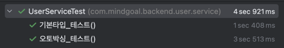

## 불필요한 객체 생성을 피하라

### 1. 객채를 매번 생성하기보다는 재사용하는 편이 좋다.
<hr>

똑같은 기능의 객체를 매변 생성하기보다는 객체 하나를 재사용하는 편이 좋을 때가 많다. 특히, 불변 객체(아이템 17)은 언제든 재사용이 가능하다.


예시로 자바에서 `String`을 생성하는 방식을 통해 한번 그 이유를 살펴보자.

```java
// new 연산자를 이용한 방식
String str1 = new String("goorm");

// 리터럴을 이용한 방식
String str2 = "goorm";
```

<br>

첫번째 코드는 실행될 때마다 `String` 인스턴스를 새로 만든다. 인스턴스를 새로 만들때마다 `heap` 영역에 `String` 인스턴스가 저장이 된다. 이 코드가 만약 반복문에서 선언된다면 쓸게없는 `String` 인스턴스가 수백만개가 만들어질 수도 있다.

두번째 코드는 새로운 인스턴스를 매번 만드는 대신 하나의 `String` 인스턴스를 재사용한다. 문자열 리터럴을 통해서 `heap` 영역에 저장되어 인스턴스가 재사용 된다.


### String이 왜 불변 클래스로 만들어졌을까?

만약 `String`이 가변(mutable)이라면 같은 참조를 가지는 객체의 값을 변경할 수 있게 된다. 이는 같은 참조 & 다른 값이라는 상황을 만들 수 있기 때문에 재사용이 불가능하다. 

또한, 가변 상태의 객체는 같은 문자열 리터럴을 가지더라도 객체를 매번 생성해야 한다. `String`이 빈번하게 사용되는 메서드나 반복문에서 쓸데없는 인스턴스가 수백만 개 만들어질 수도 있다는 것이다. 이는 애플리케이션의 성능에 안 좋은 영향을 미칠 수 있다.

```java
for (int i = 0; i < Integer.MAX_VALUE; i++) {
    String str = new String("goorm");
}
```

따라서, String을 불변으로 만들어 위와 같은 단점들을 제거하고 성능을 개선할 수 있게 된다.


### 2. 정적 팩터리 메서드를 이용하여 불필요한 객체 생성을 방지하자
<hr>

생성자 대신 정적 팩터리 메서드를 제공하는 불변 클래스는 정적 팩터리 메서드를 사용해 불필요한 객체 생성을 피할 수 있다.

생성자는 호출할 때마다 새로운 객체를 만들지만, 팩터리 메서드는 그렇지 않다. 불변 객체만이 아니라 가변 객체라 해도 사용중에 변경되지 않을 것임을
안다면 재사용할 수 있다.


자바에서 사용되는 `Boolean` 객체를 통해 어떻게 불필요한 객체 생성을 방지하는지 살펴보자.

```java
public final class Boolean implements java.io.Serializable, Comparable<Boolean> {

    public static final Boolean TRUE = new Boolean(true);
    public static final Boolean FALSE = new Boolean(false);

    // ...
    public static Boolean valueOf(String s) {
        return parseBoolean(s) ? TRUE : FALSE;
    }
}
```

코드를 보면 `Boolean.valueOf(String)`정적 팩터리 메서드를 사용하여 미리 생성된 `TRUE`, `FALSE`를 반환하는 것을 확인할 수 있다.


### 3. 객체 생성이 비싼 경우 캐싱을 통해 객체 생성을 방지해보자

<hr>

생성 비용이 아주 비싼 객체도 있다. 이런 비싼 객체가 반복해서 필요한 경우 캐싱해서 재사용하는 것을 권한다.

비싼 객체란 말은 인스턴스를 생성하는데 드는 비용이 크다는 의미이다. 즉, 메모리, 디스크 사용량, 대역폭 등이 높을수록 생성 비용이 비싸다고 한다. 하지만, 자신이 만드는 객체가 비산 객체인지를 매번 정확히 알 수는 없다.

대표적으로 정규표션식을 활용한 `Pattern`을  예시로 들 수 있다.


```java
static boolean isRomanNumeral(String str) {
    return str.matches("^(?=.)M*(C[MD]|D?C{0,3})(X[CL]|L?X{0,3})(I[XV]|V?I{0,3})$");
}
```


`String.matches`가 가장 쉽게 정규 표현식에 매치가 되는지 확인하는 방법이긴 하지만 성능이 중요한 상황에서 반복적으로 사용하기에 적절하지 않다.

<br>

그 이유는 내부적으로 `Pattern` 인스턴스를 만들어 사용하는데 `Pattern` 인스턴스는 **입력받은 정규표현식의 유한 상태 머신**을 만들기 때문에 생성 비용이 높다. 이런 생성 비용이 높은 `Pattern` 인스턴스를 한 번 쓰고 버리는 구조이다. 즉, 비싼 객체라고 할 수 있다.


이런 문제를 개선하기 위해서는 `Pattern` 객체를 만들어 컴파일하고 재사용을 하는 것이 좋다.

<br>

```java
public class RomanNumber {
    private static final Pattern ROMAN = Pattern.compile("^(?=.)M*(C[MD]|D?C{0,3})(X[CL]|L?X{0,3})(I[XV]|V?I{0,3})$");

    static boolean isRomanNumeral(String str) {
        return ROMAN.matcher(str).matches();
	}
}

```

두 방법의 성능을 확인해본 결과 캐싱된 인스턴스를 사용하는 경우 약 7배 정도의 성능 향상이 발생했다는 것을 확인할 수 있다.


<br>

> 정규표현식의 유한 상태 머신

유한 상태 머신은 주어지는 모든 시간에서 처해 있을 수 있는 유한 개의 상태를 가지고 주어지는 입력에 따라 어떤 상태에서 다른 상태로 전환시키거나 출력이나 액션이 일어나게 하는 장치를 나타낸 모델이다.


### 4. 오토 박싱을 사용할 때 주의하라

<hr>

오토 박싱은 기본 타입과 박싱 된 기본 타입을 자동으로 변환해주는 기술이다.


하지만 이를 잘못 사용하게 되면 불필요한 메모리 할당과 재할당을 반복하여 성능이 느려질 수 있다.


다음 코드를 통해서 한변 살펴보자.


```java
void 오토박싱_테스트() {
    Long sum = 0L;
    for(long i = 0; i <= Integer.MAX_VALUE; i++) {
        sum += i;
    }
}

void 기본타입_테스트() {
    long sum = 0L;
    for(long i = 0; i < Integer.MAX_VALUE; i++) {
        sum += i;
    }
}
```


그리고 해당 코드들을 테스트를 통해 시간을 확인해보았다.




`Long` 타입에서 `long` 타입으로 변경해주는 것 만으로도 엄청난 성능 차이가 나는 것을 확인할 수 있다.

정리하자면, 꼭 박싱 타입이 필요한 경우가 아니라면 기본 타입을 사용하고, 의도치 않은 오토 박싱이 숨어들지 않게 주의하자.


## 결론

<hr>

이번 아이템의 내용을 **`객체 생성은 비싸니 무조건 피해야한다`로 오해하면 안된다**.

특히 요즘의 `JVM`에서는 별다른 일을 하지 않는 작은 객체를 생성하고 회수하는 일은 크게 부담되지 않는다. 프로그램의 명확성, 간결성, 기능을 위해서 객체를 생성하는 것이라면 일반적으로 더 좋은 일이다. `ex) 3/5 수업내용에서 언급된 Dto`

다만, 정말 아주 무거운 객체가 아닌 이상, 단순히 객체 생성을 피하고자 본인만의 객체 풀을 만들지 말자.
JVM의 가비지 컬렉터는 상당히 잘 최적화 되어있어 가벼운 객체를 다룰 때는 본인이 만든 객체 풀보다 훨씬 빠르다.

**추가적으로 필요 없는 객체를 반복 생성했을 때의 피해보다 방어적인 복사(아이템 50)가 필요한 상황에서 객체를 재사용했을 때의 피해가 훨씬 크다는 사실을 항상 기억해두자.**

**객체 생성은 그저 코드 형태와 성능에만 영향이 가기 때문에 항상 방어적 복사를 신경써서 하도록 하자.**
