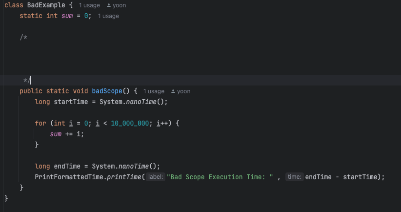
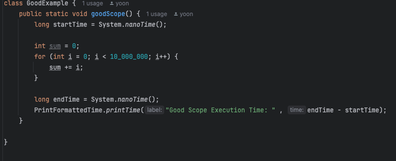

# 아이템 57. 지역변수의 범위를 최소화화라.

## 1. 왜 지역변수의 범위를 최소화해야 할까?
### - 먼 부분에서 미리 지역변수를 선언부터 해두면 가독성이 떨어지고, 정작 사용하는 시점엔 초깃값이 기억나지 않을 수도 있기 때문이다.

##### 위의 예시 코드는 간단하지만, 코드가 복잡하다고 가정하면 어떤 지역변수를 선언했는지, 값은 몇이었는지 기억이 잘 안날 수도 있다.

## 2. 그럼 어떻게 지역변수를 사용해야할까?

### - 거의 모든 지역변수는 선언과 동시에 초기화해야한다.

### - 메서드를 작게 유지하고 한가지 기능에 집중시켜 지역변수 범위 최소화해야한다.

##### 위의 코드 예시와 같이 필요할때 바로 선언함과 동시에 초기화를 같이하여 사용해야 가독성도 높이고 지역변수를 사용하고 바로 회수할 수도 있다.